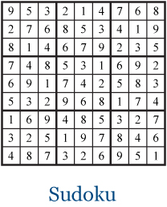

# 9.5-Sudoku

### Programming Assignment: Sudoku Board Generation

#### Task Overview:
You are required to create a Java program that generates a complete Sudoku board, adhering to the Sudoku rules. The completed board serves as the initial state before obscuring numbers to create the puzzle for the game.

#### Instructions:
1. **Method to Implement:** Write a Java method named `generateBoard()` within the `Sudoku` class. This method should generate and return a complete Sudoku board.

2. **Sudoku Board Criteria:**
    - The board must be a 9x9 grid divided into nine 3x3 subgrids.
    - Each row, column, and subgrid must contain the numbers 1 to 9 exactly once, adhering to Sudoku rules.
    - Ensure that the generated board has a unique solution.

3. **Implementation Guidelines:**
    - Utilizing helper functions in `generateBoard` simplifies the code by breaking down the Sudoku board generation process into smaller, specialized tasks. 
    - This modular approach enhances code readability and maintainability by isolating specific functionalities into distinct functions with descriptive names. 

4. **Efficiency (Time):**
    - There are several ways of writing the `generateBoard()` method. Some are more efficient than others. Work with a classmate to find the most efficient method.
    - We will measure efficiency by the time that it takes the function to run.
    

